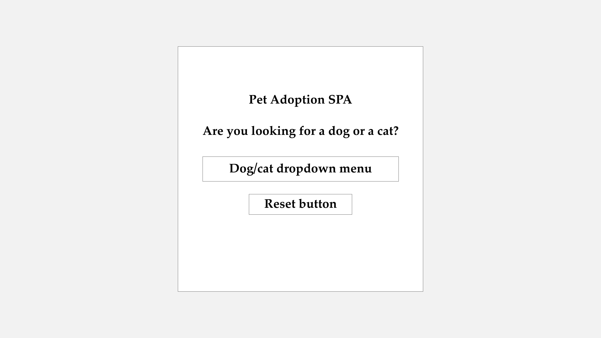
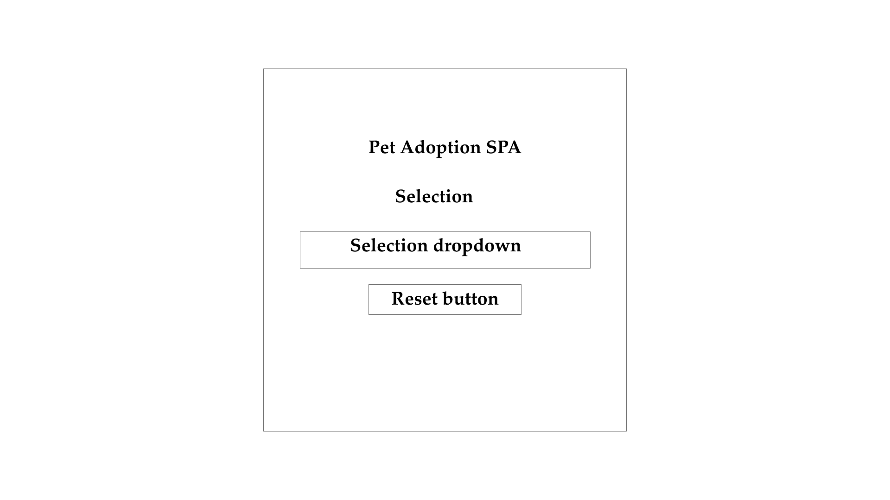
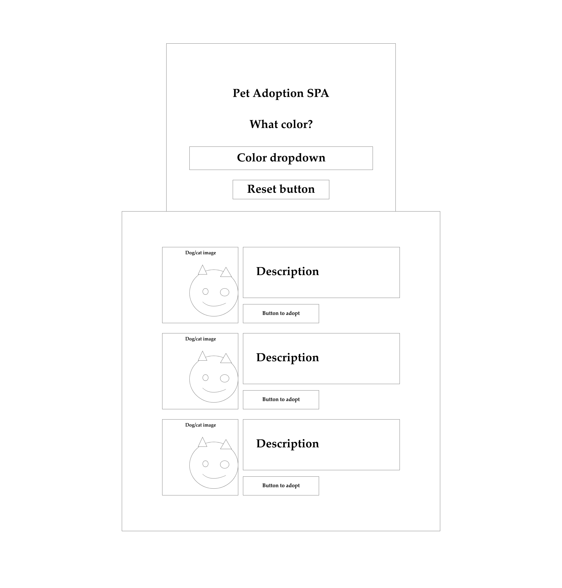

# Pet-Adoption-SPA

### Pitch

Pet adoption SPA is an interactive website that allows users to search through adoptable cats and dogs using information from the AdoptAPet API.

---

**As a** user 

**I want to** search for a dog or cat to adopt based on certain parameters

**So that** I can view a collection of  “cards” containing available animals with basic pet information including: name, picture and color

---

**As a** User

**I want to** Filter my search results by “dog” or “cat” of animal that I am interested in adopting

**So that** I can filter our potential adoptees that are irrelevant to my search.


---

**As a** User

**I want to** select the color of my future pet

**So that** I can find a pet that is aesthetically pleasing to my eye


---

**As a** User

**I want to** expand an animal’s profile through a click

**So that** I can learn more information about the dog or cat, including: name, picture, color,  breed, size, and location


---

**As a** User

**I want to** reset my search and start over

**So that** I can restart my search if I’m not finding what I’m looking for or change my mind on my preferences




To start, run 
``` 
json-server --watch db.json 
```

### Searching with dropdown:
- [ ] species
- [ ] age
- [ ] gender
- [ ] size

### TODO:
- [ ] Task 1
- [ ] Task 2
- [ ] Task 3
- [ ] Task 4